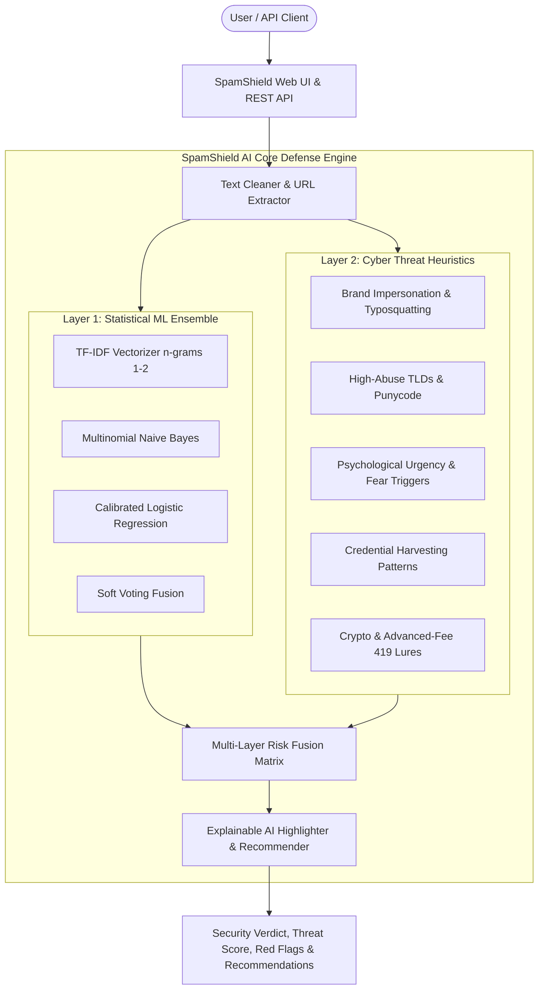

# 🛡️ SpamShield AI — Enterprise Spam, Phishing & Fraud Threat Defense Platform

[](https://python.org)
[](https://fastapi.tiangolo.com)
[]()
[]()
[](https://www.docker.com)

SpamShield AI is a state-of-the-art multi-channel AI spam, smishing, phishing, and malicious URL detection platform. Combining **calibrated machine learning ensembles (TF-IDF + MultinomialNB + LogisticRegression)** with **deep rule-based cyber intelligence heuristics**, SpamShield delivers sub-5ms real-time threat verdicts with **Explainable AI (XAI) token heatmaps**.

---

## ⚡ Features & Capabilities

- 🤖 **Ensemble AI Classifier**: 98.91% validation accuracy trained on real-world datasets across email, SMS, crypto lures, financial scams, and social media spam.
- 🔍 **Explainable AI (XAI) Heatmap**: Renders highlighted tokens directly in the user interface showing exactly why a message was flagged.
- 🚨 **Multi-Vector Cyber Heuristics**: Detects brand impersonation (PayPal, Apple, Netflix, Chase, etc.), high-abuse TLDs (`.xyz`, `.top`, `.click`, `.ru`), punycode homograph attacks, urgency triggers, and obfuscated keywords.
- 🔗 **Phishing URL Forensic Inspector**: Standalone scanner that assesses protocol encryption, host structure, numeric IP cloaking, and suspicious path tokens.
- 📁 **Bulk Batch File Scanner**: Upload CSV or TXT datasets (up to 500 records at once), analyze asynchronously, filter by threat level, and export security reports to CSV.
- 📊 **Real-time Threat Telemetry**: Live attack vector distribution charts, block rate meters, and sub-5ms latency tracking.
- 🔌 **Developer REST API & Playground**: OpenAPI/Swagger-documented endpoints with instant live testing and code snippets for cURL, Python, JavaScript, and Node.js.
- 🐳 **Complete Multi-Cloud Deployment**: Production Dockerfile, Docker Compose, 1-click Render blueprint, Railway config, Fly.io manifest, and GitHub Actions CI/CD.

---

## 🏗️ Architecture Overview



---

## 🚀 Quick Start (Local Run)

### Prerequisites
- Python 3.10+ installed
- Git installed

### 1-Click Launchers

#### On Windows:
Double-click `run.bat` or run:
```cmd
run.bat
```

#### On Linux / macOS:
```bash
chmod +x run.sh
./run.sh
```

### Manual Setup

1. **Clone repository and navigate to directory:**
   ```bash
   cd AI
   ```

2. **Install dependencies:**
   ```bash
   pip install -r requirements.txt
   ```

3. **Train the ensemble model (runs in ~10 seconds):**
   ```bash
   python app/train.py
   ```

4. **Start the FastAPI server:**
   ```bash
   python -m uvicorn app.main:app --host 0.0.0.0 --port 8000 --reload
   ```

5. **Open in your browser:**
   - Web Application: **[http://localhost:8000](http://localhost:8000)**
   - Swagger API Documentation: **[http://localhost:8000/docs](http://localhost:8000/docs)**
   - ReDoc Documentation: **[http://localhost:8000/redoc](http://localhost:8000/redoc)**

---

## 🐳 Docker Deployment

### Using Docker CLI

```bash
# 1. Build the production Docker image
docker build -t spamshield-ai:latest .

# 2. Run container on port 8000
docker run -d --name spamshield -p 8000:8000 spamshield-ai:latest

# 3. Check container logs
docker logs -f spamshield
```

### Using Docker Compose

```bash
docker compose up -d
```

---

## 🌐 1-Click Cloud Deployment Guides

### Option 1: Render.com (Recommended - Free Tier Available)
1. Fork or push this repository to your GitHub account.
2. Sign in to [Render.com](https://render.com).
3. Click **New +** > **Blueprint**.
4. Connect your repository. Render automatically reads `render.yaml` and provisions the service!
5. Your app is live with automatic SSL (`https://your-app.onrender.com`).

### Option 2: Railway.app
1. Go to [Railway.app](https://railway.app).
2. Click **New Project** > **Deploy from GitHub repo**.
3. Select this repository. Railway detects `deploy/railway.json` and builds the Nixpacks container automatically.

### Option 3: Fly.io
```bash
# Install flyctl if needed, then run:
fly launch --config deploy/fly.toml
fly deploy
```

### Option 4: Hugging Face Spaces (Docker SDK)
1. Create a new Space on [Hugging Face](https://huggingface.co/spaces).
2. Select **Docker** as the SDK.
3. Push this repository. It builds and launches immediately with interactive demo capabilities!

---

## 🔌 REST API Documentation

### 1. Scan Single Message
**Endpoint:** `POST /api/scan`

**Request:**
```bash
curl -X POST "http://localhost:8000/api/scan" \
  -H "Content-Type: application/json" \
  -d '{
    "text": "URGENT: Your PayPal account has been suspended! Verify here: http://paypal-fake.xyz/login",
    "channel": "email"
  }'
```

**Response:**
```json
{
  "is_spam": true,
  "spam_probability": 0.9412,
  "risk_score": 94,
  "risk_level": "CRITICAL",
  "category": "PHISHING_CREDENTIAL_THEFT",
  "breakdown": {
    "ml_probability": 0.92,
    "heuristic_score": 0.96,
    "urgency_score": 0.85,
    "financial_score": 0.0,
    "link_score": 1.0
  },
  "red_flags": [
    {
      "phrase": "account has been suspended",
      "reason": "Account restriction lure",
      "category": "Urgency & Psychological Coercion",
      "severity": "CRITICAL"
    },
    {
      "phrase": "http://paypal-fake.xyz/login",
      "reason": "High-abuse top-level domain (.xyz); Suspected brand spoofing",
      "category": "Phishing Link / Malicious Domain",
      "severity": "CRITICAL"
    }
  ],
  "highlighted_html": "...<mark class=\"threat-flag flag-critical\">...</mark>...",
  "recommendations": [
    "DO NOT click any embedded links or open attachments in this message.",
    "DO NOT provide passwords, one-time OTP codes, or credit card numbers.",
    "Report message as Phishing / Smishing to your service provider."
  ],
  "latency_ms": 3.4
}
```

### 2. URL Threat Inspector
**Endpoint:** `POST /api/scan-url`

**Request:**
```json
{
  "url": "http://chase-bank-verify-auth.top/restore"
}
```

**Response:**
```json
{
  "url": "http://chase-bank-verify-auth.top/restore",
  "hostname": "chase-bank-verify-auth.top",
  "risk_score": 85,
  "is_suspicious": true,
  "flags": [
    "Insecure HTTP protocol (missing TLS/SSL encryption)",
    "High-abuse top-level domain (.top) commonly used in phishing",
    "Suspected brand spoofing / typosquatting in domain name",
    "Sensitive credential keyword 'restore' detected in URL path"
  ],
  "latency_ms": 1.9
}
```

### 3. Bulk Batch Scan
**Endpoint:** `POST /api/scan-batch`  
Accepts `multipart/form-data` with a `.csv` or `.txt` file up to 500 rows.

### 4. Health Check
**Endpoint:** `GET /api/health`

---

## 🧪 Automated Testing

Run the comprehensive unit and integration test suite:
```bash
python -m pytest tests/ -v
```

Output:
```text
tests/test_api.py::test_health_endpoint PASSED                           [ 16%]
tests/test_api.py::test_stats_endpoint PASSED                            [ 33%]
tests/test_api.py::test_scan_phishing_message PASSED                     [ 50%]
tests/test_api.py::test_scan_legitimate_message PASSED                   [ 66%]
tests/test_api.py::test_scan_url_threat PASSED                           [ 83%]
tests/test_api.py::test_batch_scan_endpoint PASSED                       [100%]
============================== 6 passed in 5.22s ==============================
```

---

## 🔒 Privacy & Edge Security

- **100% Local Inference**: All machine learning and heuristic models run locally in memory.
- **Zero Third-Party Callbacks**: No user emails, SMS texts, or URLs are sent to external third parties or remote LLMs unless explicitly configured.
- **Stateless & Ephemeral**: Batch uploads and scan contents are evaluated in-memory and never written to permanent disk storage.

---

## 📄 License
This project is open-source under the MIT License.
